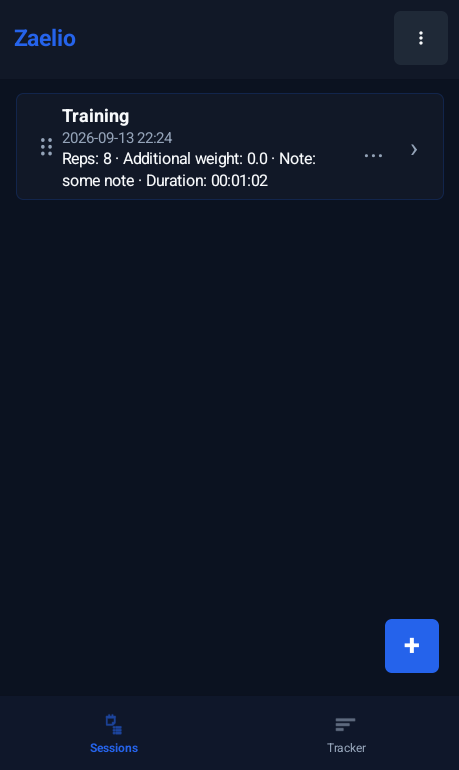
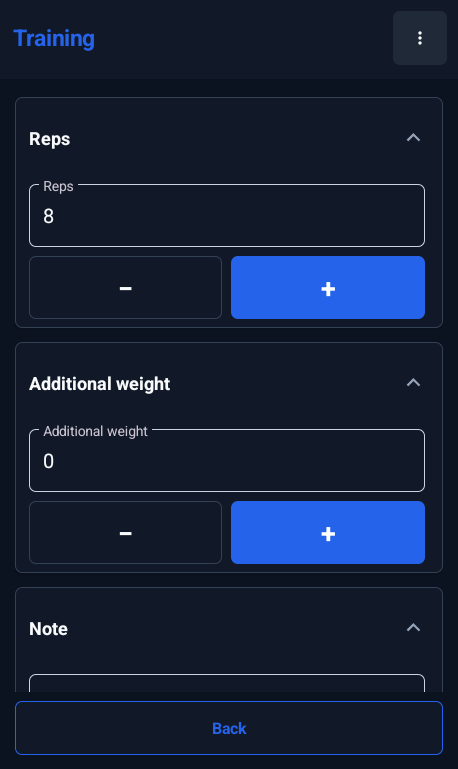
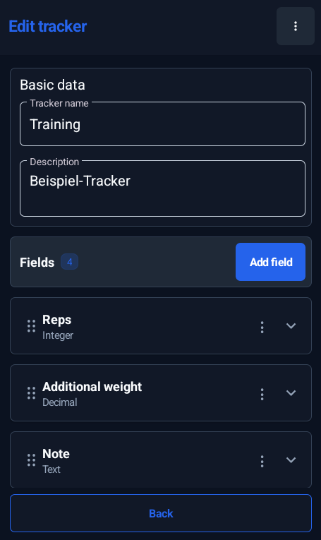
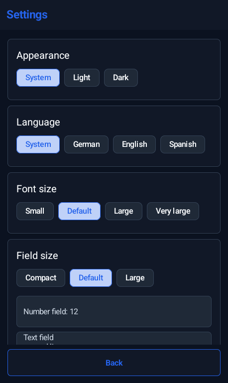
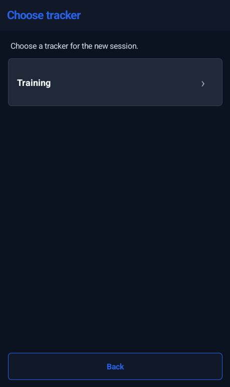
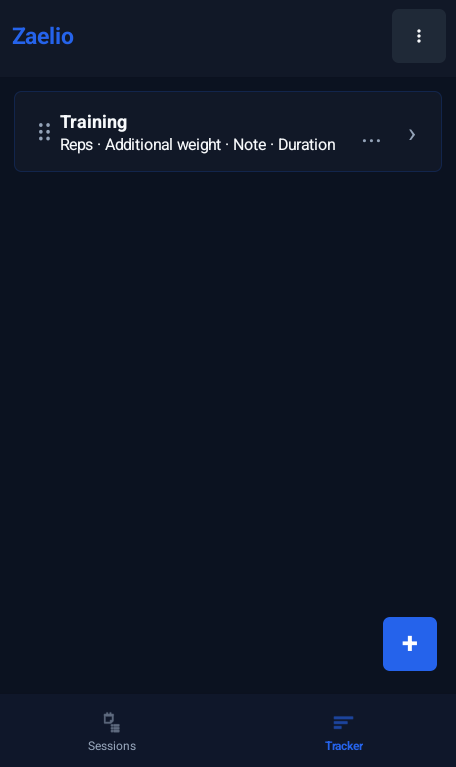
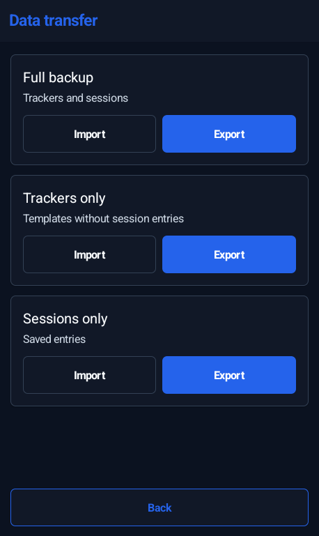

# 📊 Zaelio

Eine kleine Android-App zum Erstellen eigener Tracker, Starten von Sessions und Speichern von Messwerten lokal in SQLite.

Lizenz: MIT

Kontakt/Bugs: https://github.com/braunbearded/zaelio/issues

## ✨ Features

- Eigene Tracker mit global sortierten Feldern erstellen; neue Elemente scrollen im Editor automatisch in den sichtbaren Bereich
- Tracker-Felder umsortieren oder umbenennen, ohne gespeicherte Session-Werte zu verlieren
- Sessions erfassen und fortsetzen, mit großen Plus/Minus-Buttons (Plus in Akzentfarbe, Minus grau wie Reset) und Material-Feldern für Text, Zahlen und Timer
- Session-Felder minimal animiert ein-/ausklappen; Startzustand in den Einstellungen wählen
- Listen-Einträge per Long-Press, Links-Swipe oder `...`-Menü löschen; abgebrochene Swipes lösen keine Löschaktion aus
- Sessions und Tracker mit Trefferzahl, entfernbaren Filter-Chips und einem zentrierten Material-Popup filtern/sortieren: gespeicherte Tracker, Session-Zeitraum und manuell/neueste/älteste/Trackername A–Z
- Sessions und Tracker per Drag-Handle in der ungefilterten, manuell sortierten Übersicht sortieren
- Android-Zurück navigiert sinnvoll; auf Home beendet erst ein schneller Doppel-Zurück-Druck die App
- Werte lokal in SQLite speichern
- Tracker, Sessions oder komplette Backups als JSON importieren/exportieren
- Helles/dunkles Design, Schriftgröße (auch für Editor-Eingaben, Dropdown-Einträge, Checkboxen und Einstellungs-Chips), Akzentfarbe, globale Feldgröße und Session-Feld-Startzustand einstellbar
- Kein Google Play Services, kein Firebase, keine Cloud

## Filter und Sortierung

- Die Filterleiste liegt in einer eigenen Karte mit demselben Hintergrund wie Session-/Tracker-Karten, mit Abstand zum Header und zur Liste. Schrift und Icons der Filter- und Sortierungsbuttons verwenden die gewählte Akzentfarbe. Innenabstände ober-/unterhalb der Buttonzeile und zur folgenden Chip-Gruppe sind einheitlich. Filter- und Sortierungsbuttons bleiben auch bei mehrzeiligen Beschriftungen gleich hoch und ausgerichtet.
- „Filter“ öffnet ein zentriertes, scrollbares Material-Popup im selben Kartenstil wie die Sortierung, ohne Einfahren von unten. In der Session-Übersicht werden nur Tracker mit vorhandenen Sessions angeboten; die Tracker-Übersicht bietet weiterhin alle gespeicherten Vorlagen an. Mehrere ausgewählte Tracker werden kombiniert, keine Auswahl zeigt alle.
- Zeitraumfilter beziehen sich auf das **Erstellungsdatum der Sessions**, nicht auf spätere Bearbeitungen oder das Anlegen eines Trackers. In der Tracker-Übersicht bleiben bei einem aktiven Zeitraum nur Tracker mit mindestens einer passenden Session sichtbar.
- „7 Tage“ und „30 Tage“ schließen heute ein und sind nur wählbar, wenn Sessions der gewählten Tracker darin liegen. „Eigener Zeitraum“ startet mit deren erstem/letztem Session-Datum; die Material-Datumsauswahl ist auf diese Grenzen beschränkt. Ohne Sessions sind Zeitraumoptionen deaktiviert. Beide Grenztage zählen vollständig in der lokalen Zeitzone, auch beim Sommerzeitwechsel; ein eigener Zeitraum ohne Treffer kann nicht übernommen werden.
- Nach Anlegen/Löschen von Sessions oder Trackern werden Optionen, Chips, Trefferzahlen und Datumsgrenzen neu aus den verbleibenden Daten ermittelt. Ein Tracker verliert seine Session-Filteroption, wenn seine letzte Session gelöscht wurde. Nicht mehr mögliche Tracker-/Zeitraumfilter werden entfernt, gültige eigene Datumsgrenzen bei Bedarf angepasst; die Sortierung bleibt erhalten.
- Die Trefferzahl im Popup aktualisiert sich sofort. Erst „… anzeigen“ übernimmt Änderungen; Schließen, Zurück und Tippen außerhalb verwerfen sie. „Zurücksetzen“ leert den Entwurf und stellt die manuelle Sortierung wieder her. Aktive Filter lassen sich einzeln über das × ihrer Chips entfernen.
- Filter und Sortierung werden pro Tab separat lokal gespeichert. Standard bleibt die bestehende manuelle Reihenfolge. Neueste/älteste sortiert nach dem Erstellungsdatum des jeweiligen Eintrags; Trackername A–Z verwendet die App-Sprache.
- Filtern und Sortieren verändern keine gespeicherten Reihenfolgen oder Session-Werte. Drag-Handles erscheinen nur ohne Filter bei manueller Sortierung, damit verborgene Einträge nicht versehentlich umsortiert werden.

## Tracker bearbeiten und Session-Daten

- Felder behalten beim Bearbeiten ihre interne ID. Änderungen an Reihenfolge, Feldname, Tracker-Name oder Feldeinstellungen löschen keine gespeicherten Werte.
- Beim Umbenennen eines Feldes werden die JSON-Schlüssel seiner gespeicherten Werte mit aktualisiert; auch „Vorherigen Wert übernehmen“ funktioniert weiter.
- Neue oder kopierte Felder bekommen eigene IDs und übernehmen keine Session-Werte des ursprünglichen Feldes. Beim Löschen eines Feldes werden nur dessen Werte entfernt; andere Felder und die Sessions bleiben erhalten.
- Tracker-Änderungen werden atomar gespeichert: Fehler rollen die gesamte Änderung zurück. Die Datenbank bleibt auf Schema v8; dieses Update benötigt keine Migration.
- Gelöschte Felder verlassen auch die Sortierliste des Editors; anschließendes Verschieben speichert die sichtbare Reihenfolge.
- Leere Session-Eingaben werden als explizites JSON-`null` gespeichert. Bei „Vorherigen Wert übernehmen“ bleibt ein zuvor geleerter Wert leer, statt auf den Standardwert zurückzufallen.
- Backup-Imports sind atomar, auch bei SQLite-Schreibfehlern (z. B. doppelten Records). Fehlerhafte Imports hinterlassen keine teilweise importierten Daten; unbekannte Session-/Feldreferenzen werden weiterhin übersprungen.
- Bereits durch ältere Versionen gelöschte Werte lassen sich nur aus einem zuvor erstellten Backup wiederherstellen. JSON-Imports legen weiterhin neue Tracker/Sessions an, statt bestehende zu überschreiben.

## 📱 Screenshots

| Sessions | In Session | Tracker Editor | Settings |
|---|---|---|---|
|  |  |  |  |
| New Session | Trackers | Data Transfer | |
|  |  |  | |

## 🧰 Benötigte Abhängigkeiten

Zum Bauen brauchst du lokal:

- JDK 21 für Release-/F-Droid-Builds; JDK 17+ reicht für lokale Entwicklung
- Android SDK mit Platform `36`
- Android Build Tools passend zum SDK
- Gradle Wrapper aus diesem Repository (`./gradlew`)

Projektabhängigkeiten:

- Android Gradle Plugin `9.3.1`
- Gradle `9.5.1`
- Material Components `com.google.android.material:material:1.14.0`

Test-Abhängigkeiten:

- JUnit `4.13.2`
- AndroidX Test Core `1.7.0`
- Robolectric `4.16.1`
- ASM `9.10.1` für Robolectric auf modernen JDKs
- org.json `20260719`

Das Projekt nutzt absichtlich keine Google Play Services und kein Firebase.

## ⚙️ Einrichtung

Wenn dein Android SDK nicht automatisch gefunden wird, erstelle im Projektordner eine `local.properties`:

```properties
sdk.dir=/pfad/zu/deinem/Android/Sdk
```

Optional Java setzen:

```bash
export JAVA_HOME=/usr/lib/jvm/java-17-openjdk
```

## 🛠️ Debug-Build erstellen

```bash
./gradlew assembleDebug
```

Die APK liegt danach hier:

```text
app/build/outputs/apk/debug/zaelio-debug.apk
```

Release-Builds sollten mit JDK 21 laufen, damit GitHub-Release und F-Droid-Buildserver dieselbe Java-Version nutzen.

## 🚀 Release-Version erstellen

**Standardweg: aktueller `main` → Versionsbranch `vX.Y.Z` → PR nach `main` → Merge → Release.** Kein direkter Release-Push auf `main` und kein manuelles Release-Tag. App-/Workflow-Änderungen vor dem Push mitcommitten; das Script nimmt nur Versionsdateien automatisch in seinen Commit auf.

```bash
./scripts/release.sh
```

Das Script bereitet einen Versionsbranch wie `v1.0.10` vor: Version und `versionCode` erhöhen, bisherige `Unreleased`-Einträge in den Release-Changelog übernehmen und einen Fastlane-Changelog mit höchstens 500 Zeichen erzeugen. Es kann Tests/Debug-Build ausführen, die Vorbereitung committen und **nur den Branch** pushen. Tags und F-Droid-Commit-Hashes werden nicht mehr vor dem Merge angelegt.

1. Versionsbranch pushen und einen PR nach `main` öffnen (Branch und PR müssen aus diesem Repository stammen). Falls im Script nicht gepusht wurde, z. B. für `1.0.10`:
   ```bash
   git push --set-upstream origin refs/heads/v1.0.10
   gh pr create --base main --head v1.0.10 --title "Release 1.0.10" --body-file /pfad/zur/pr-beschreibung.md
   ```
   Ohne GitHub CLI den PR über `https://github.com/braunbearded/zaelio/compare/main...v1.0.10?expand=1` öffnen. Das Script öffnet oder mergt keinen PR automatisch. Erst nach erfolgreichen Preview-Checks und Prüfung des Signing-Environments mergen.
2. `.github/workflows/tests.yml` testet den Versions-PR und baut eine Debug-APK beim Öffnen, Wiederöffnen und bei weiteren Commits (`synchronize`). Ein Branch-Push ohne PR startet keinen Build; so entfällt der doppelte Push-/PR-Lauf. Neuere Builds ersetzen ältere Läufe desselben PRs. Der PR bekommt einen aktualisierbaren Kommentar mit Artefakt-Download, Commit-Hash und dem vollständigen Abschnitt seiner Version aus `CHANGELOG.md`. Die Version wird gegen den Versionsbranch geprüft; das Changelog wird am exakt gebauten Commit gelesen, nicht vom inzwischen eventuell aktualisierten Branch. Fehlt der Versionsabschnitt oder ist er leer, schlägt der Kommentarjob fehl, statt falsche Release-Notizen zu posten. Der Download benötigt eine GitHub-Anmeldung und ist nur während der Artefakt-Aufbewahrungsdauer verfügbar.
3. Beim Merge startet `.github/workflows/release.yml` über `pull_request_target: closed` im vertrauenswürdigen `main`-Kontext, ausschließlich für bereits nach `main` gemergte Versions-PRs aus diesem Repository. Gebaut wird nur der exakte Merge-/Squash-Commit nach Prüfung, dass er zu `main` gehört, niemals der ungeprüfte PR-Head: Tests, signierter Release-Build und Prüfung des Signing-Zertifikats. Danach entstehen Tag `v<versionName>` am exakten Merge-/Squash-Commit und das finale GitHub Release mit `zaelio.apk` direkt im selben Workflow. Geschlossene, nicht gemergte PRs und Tag-Pushes veröffentlichen nichts.
4. Die Action aktualisiert anschließend die F-Droid-Metadaten mit diesem vollständigen Commit-Hash, stellt sie als Artefakt bereit und committet sie nach `main`.

`versionName` muss zum Versionsbranch passen (Suffixe wie `-fix` oder `/feature` sind erlaubt); `versionCode` muss für jede neue Version steigen. Die vier Signing-Secrets müssen im geschützten Environment `release` eingerichtet sein (siehe unten). Repository-Regeln müssen GitHub Actions das Schreiben von Tags und PR-Kommentaren erlauben. Für den F-Droid-Metadaten-Commit auf `main` keine pauschale Bot-Ausnahme vom Branchschutz einrichten; stattdessen bei Bedarf den Artefakt-/PR-Weg nutzen. Falls der Metadaten-Push durch Branchschutz blockiert wird, bleibt das bereits veröffentlichte Release erhalten; die Metadaten aus dem Artefakt können dann per separatem PR übernommen werden. Erst die nächste Version mergen, wenn der vorherige Release-Workflow fertig ist.

Versionsbranch und Tag dürfen denselben Namen haben. Bestehende Tags auf einem anderen Commit werden niemals überschrieben; einen vorab lokal erzeugten Tag (insbesondere den bisherigen `v1.0.9`) **nicht pushen**. Bei einem fehlgeschlagenen Workflow dessen Lauf erneut starten: Ein passender Tag und ein bereits angelegtes Release werden wiederverwendet.

Bei `Branch "refs/pull/.../merge" is not allowed to deploy to release` ist der Auslöser falsch, nicht die `main`-Regel: GitHub prüft bei `pull_request` auch nach dem Merge die PR-Referenz. Das Release braucht den geschützten Default-Branch-Kontext (`main`) über den oben abgesicherten `pull_request_target`-Auslöser. **Keine** `refs/pull/*`- oder Freigabe für alle Branches hinzufügen. Der alte Lauf verwendet beim Wiederholen weiterhin seinen alten Workflow; nach dieser Korrektur einen neuen Versions-Fix-PR öffnen und mergen (z. B. `v1.0.9-fix`). Version/Code nur dann beibehalten, wenn diese Version noch keinen veröffentlichten Tag/Release hat; `scripts/release.sh` nicht erneut zur Reparatur starten.

Tag prüfen oder bei Fehler löschen:

```bash
git tag
git show refs/tags/v1.1.0
git tag -d v1.1.0
git push origin :refs/tags/v1.1.0
```

## 🔐 Release signieren

Für bestehende Zaelio-Releases den vorhandenen Release-Keystore und Alias weiterverwenden; nicht für jedes Release einen neuen Key erzeugen. Das Zertifikat muss zu `AllowedAPKSigningKeys` passen.

Keystore nur für die erstmalige Einrichtung erstellen:

```bash
keytool -genkeypair -v -keystore zaelio-release.jks -alias zaelio -keyalg RSA -keysize 4096 -validity 10000
```

Keystore als GitHub Secret ablegen:

```bash
base64 -w0 zaelio-release.jks
```

Vor dem ersten Merge auf GitHub **Settings → Environments → New environment → `release`** konfigurieren:

- Unter **Deployment branches and tags → Selected branches and tags** nur eine **Branch**-Regel für `main` erlauben, keine Tag-Regel.
- Die vier folgenden Signing-Secrets als **Environment secrets** einrichten. Bestehende gleichnamige Repository-/Organization-Secrets für dieses Repo entfernen bzw. deren Zugriff entziehen, nicht zusätzlich behalten: Schreibberechtigte könnten sie sonst über geänderte Branch-Workflows auslesen.
- Optional **Required reviewers** setzen; **Prevent self-review** benötigt eine andere freigabeberechtigte Person. Ohne weiteren Reviewer kann eine Ein-Personen-Konfiguration dadurch blockiert werden.
- `main` separat über Branchschutz/Rulesets schützen (PR-Pflicht, Checks und zum Team passende Reviews) und Schreibrechte nur vertrauenswürdigen Personen geben. Die Environment-Regel `main` verhindert **keine direkten Git-Pushes** auf diesen Branch. Environment-Schutz muss in den GitHub-Einstellungen eingerichtet werden; `environment: release` im YAML allein reicht nicht. Ein unbekanntes Environment wird von GitHub ohne Schutzregeln angelegt.

Die Actions sind auf vollständige, aus den offiziellen Upstream-Repositories geprüfte Commit-SHAs gepinnt. Bei Updates die SHAs erneut upstream verifizieren, statt bewegliche Versionstags einzutragen.

Benötigte Environment-Secrets:

```text
ANDROID_SIGNING_KEY_BASE64
ANDROID_KEYSTORE_PASSWORD
ANDROID_KEY_ALIAS
ANDROID_KEY_PASSWORD
```

Lokal kann eine signierte APK mit denselben Umgebungsvariablen gebaut werden:

```bash
ANDROID_KEYSTORE_PATH=/pfad/zu/zaelio-release.jks \
ANDROID_KEYSTORE_PASSWORD=... \
ANDROID_KEY_ALIAS=zaelio \
ANDROID_KEY_PASSWORD=... \
./gradlew assembleRelease
```

Ohne diese Variablen erzeugt Gradle weiterhin nur eine unsigned Release-APK. Release-Builds heißen `app/build/outputs/apk/release/zaelio.apk`, Debug-Builds `app/build/outputs/apk/debug/zaelio-debug.apk`. Die Release-Action prüft den APK-Signing-Zertifikat-Hash gegen `AllowedAPKSigningKeys` und schreibt ihn in die GitHub-Release-Notes.

## 📦 F-Droid

Vor der Einreichung bei F-Droid:

- `LICENSE`, `CHANGELOG.md`, Fastlane-Metadaten, `fastlane/metadata/android/en-US/changelogs/<versionCode>.txt` und Screenshots aktuell halten.
- Pro Release `versionCode` erhöhen; die Merge-Action setzt den Tag wie `v1.1.0`.
- `docs/fdroiddata/com.zaelio.app.yml` für die neue Version aktualisieren: voller Commit-Hash, `Binaries`, `AllowedAPKSigningKeys`.
- Prüfen, ob F-Droid die verwendete Kombination aus Android Gradle Plugin und `compileSdk` bauen kann.
- Nach dem GitHub-Release lokal prüfen: `FDROIDDATA_DIR=/path/to/fdroiddata ./scripts/check-fdroid-reproducible.sh`

Details: `docs/fdroid.md`

## 📁 Projektstruktur

```text
app/src/main/java/com/zaelio/app/
├── MainActivity.java              # Routing, Lifecycle, Top Bar, Navigation
├── TrackingDatabase.java          # SQLite Schema v8, Migrationen, Datenzugriff
├── TrackerJsonRepository.java     # JSON Import/Export und Tracker-Speicherung
├── BackupJsonRepository.java      # JSON Backup für Tracker, Sessions und Werte
├── JsonUtil.java                  # JSON-Helfer
├── FormatUtil.java                # Gemeinsame Formatierung
├── Models.java                    # Datenmodelle
├── HomeUi.java                    # Session-/Tracker-Übersicht, Filterleiste und Chips
├── OverviewOptions.java           # Filter-/Sortierzustand pro Tab und lokale Datumsgrenzen
├── OverviewFilterUi.java          # Material-Filter-Popup und Datumsauswahl
├── ReorderHelper.java             # Gemeinsames Drag-Reorder-Verhalten
├── TrackerFlowUi.java             # Tracker-Editor und Session-Routing
├── FieldInputUi.java              # Eingabefelder, Timer, Zahlensteuerung und einklappbare Session-Felder
├── theme/ThemeStore.java          # Theme, Akzentfarbe, Schrift-/Feldgröße und Session-Feld-Startzustand
└── ui/
    ├── AppUi.java                 # Gemeinsame UI-Bausteine
    └── SettingsUi.java            # Einstellungen und Über-Screen
```

## 🧪 Tests

Lokale Unit-Tests laufen mit JUnit und Robolectric:

```bash
./gradlew testDebugUnitTest
```

GitHub Actions führt für PRs nach `main` aus vorbereiteten Versionsbranches desselben Repositorys (z. B. `v1.2.3`, `v1.2.3-fix` oder `v1.2.3/feature`) die Tests und `assembleDebug` mit Ubuntu/JDK 21 aus, ohne Signing-Secrets. Auslöser sind Öffnen, Wiederöffnen und weitere Commits im offenen PR; reine Branch-Pushes ohne PR bauen nicht. Die Debug-APK wird als Artefakt gespeichert und in offenen PRs nach `main` verlinkt. Nur der Merge eines solchen PRs erstellt Tag und signiertes Release.

Die Release-Helfer werden ohne zusätzliche Abhängigkeiten geprüft:

```bash
python3 -m unittest discover -s scripts -p 'test_*.py'
```

Debug-APKs haben dieselbe App-ID, aber eine andere Signatur als Release-APKs; auch zwischen CI-Läufen kann die Debug-Signatur wechseln. Ein Wechsel kann eine Neuinstallation verlangen, die lokale Daten löscht: vorher ein Backup erstellen.

Aktueller Fokus:

- `JsonUtilTest` prüft JSON-Roundtrips einschließlich expliziter `null`-Schlüssel und Tracker-Export.
- `TrackingDatabaseTest` prüft Seed-Daten, Sessions, Records, Previous Values, Löschlogik, Batch-Speicherung, Übersichtssortierung und Migration auf Schema v8.
- `BackupJsonRepositoryTest` prüft alle Backup-Export/Import-Varianten gegen Beispiel-JSON unter `app/src/test/resources/backup-fixtures/`, Rollback nach teilweise ausgeführtem Import (JSON- und SQLite-Fehler, einschließlich doppelter Records) sowie Session-Import nach Feldsortierung mit unbekannten Referenzen.
- `TrackerJsonRepositoryTest` prüft Werterhalt über mehrere Sessions bei Sortierung, Metadatenänderungen, Umbenennung/Schlüsseltausch, Hinzufügen/Löschen, Duplikaten, Backup-Import und Datenbank-Neuöffnung. Fehlerfälle umfassen fehlende IDs/Tracker, fehlerhafte Neuanlage und beschädigte gespeicherte JSON-Werte; auch das Entfernen aller Felder muss Sessions und Zeitstempel erhalten.
- `TrackerFlowUiTest` prüft die Akzentfarbe für Plus und den Reset-Stil für Minus in beiden Themes und allen Feldgrößen, Schriftgrößen für Editor-Controls/Dropdowns/Einstellungs-Chips sowie Drag-/Autosave (auch nach dem Löschen eines mittleren Feldes), Umbenennen, Kopieren/Löschen und leere Namen im tatsächlichen Editor sowie stabile IDs. Session-Tests prüfen bearbeitbare Controls, Debounce-Neustart und Dirty-Field-Speicherung, sofortiges Speichern und Timer-Stopp beim Verlassen sowie die Unterscheidung zwischen gespeicherten Werten, explizitem `null` und fehlenden Vorbelegungswerten einschließlich Leeren/Speichern/Vorbelegen über die UI.
- `HomeUiTest` und `OverviewOptionsTest` prüfen das zentrierte Material-Popup, echte Tracker-Auswahl, Live-Trefferzahlen, Übernehmen/Verwerfen/Zurücksetzen, Filter-Chips, begrenzte Material-Datumsauswahl, alle Sortierungen, Persistenz pro Tab und unveränderte manuelle Reihenfolgen. Löschtests prüfen letzte Sessions, entfernte Datumsgrenzen, leere Daten und wieder hinzukommende Tracker-Optionen. Native-Graphics-Tests prüfen mehrzeilige Sortierungsbuttons in drei Sprachen/Schriftgrößen sowie die separate Filterkarte mit Session-/Tracker-Hintergrund, Buttonschrift/-icons in Akzentfarbe und gleichmäßigen Abständen, mit und ohne Chips in beiden Tabs/Themes. Datumsprüfungen umfassen vollständige Grenztage, lokale Zeitzonen, Sommerzeit und Zeiträume anhand der Sessions statt Tracker-Erstellung.
- `DeleteGestureHelperTest` prüft Richtung/Länge von Swipes, abgebrochene Gesten, ausgeschlossene Eingabe-Unterbäume, Long-Press-Abbruch, nicht stapelbare Bestätigungsdialoge, verzögerte Löschung und nicht-farbliches Auswahlfeedback bei roter Akzentfarbe.

Die Tests prüfen Verhalten und Regressionen; eine automatische Zeilen-/Branch-Coverage-Auswertung ist aktuell nicht eingerichtet.

Zusätzlicher Build-Check:

```bash
./gradlew assembleDebug
```

## 📝 Hinweise

- App-Daten bleiben lokal auf dem Gerät.
- Die App nutzt `android.permission.VIBRATE` nur für kurzes Feedback beim Markieren eines Löschkandidaten.
- `local.properties`, Keystores und Passwörter nicht committen.
- Für F-Droid/OSS-Builds nur freie Abhängigkeiten verwenden.
